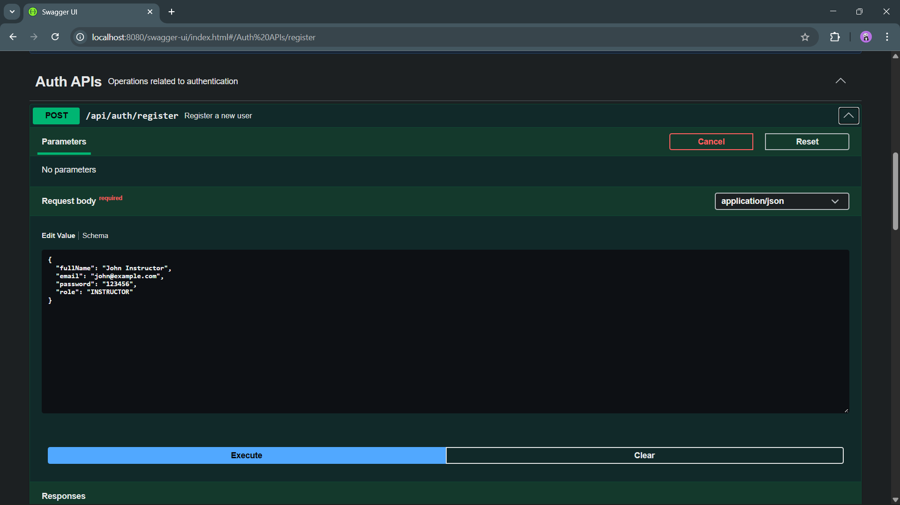
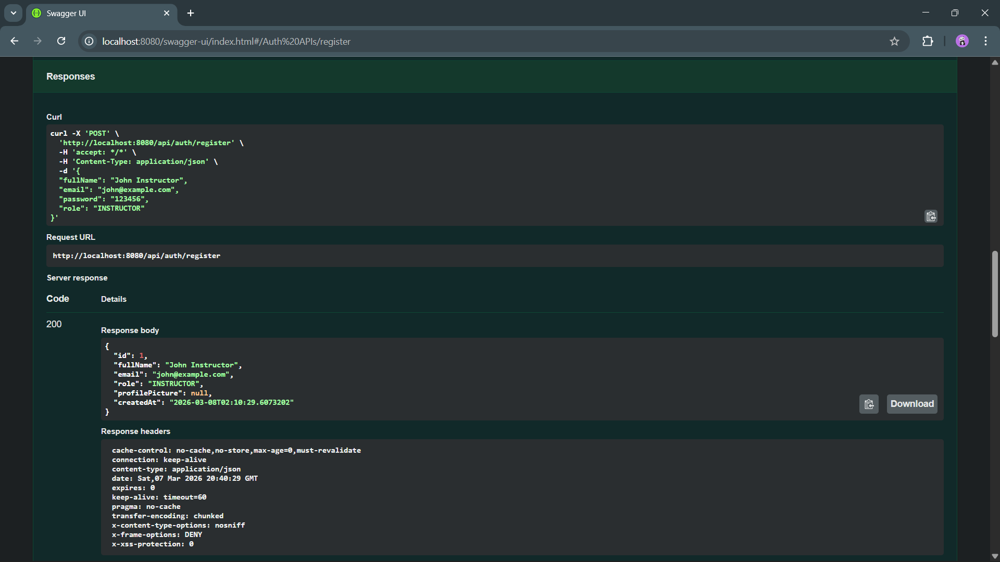

# Course Management System – Spring Boot REST API

# API Testing Order

Because of entity relationships, APIs must be tested in the following order:

```
1. Create Users
2. Create Course
3. Enroll Student
4. Upload Course Material
5. Test Read APIs
```

---

# 1. User Management APIs

Users must be created before courses or enrollments.

Two roles exist:

```
INSTRUCTOR
STUDENT
```

---

## Register User

Create a new user in the system.

**Endpoint**

```
POST /api/auth/register
```

**Request Body**

```json
{
  "fullName": "John Instructor",
  "email": "john@example.com",
  "password": "123456",
  "role": "INSTRUCTOR"
}
```

**Response**

Returns created user details.

---

### Screenshot

<p align="center">
  
  
</p>

---

## Login User

Authenticates a user.

**Endpoint**

```
POST /api/auth/login
```

**Request Body**

```json
{
  "email": "john@example.com",
  "password": "123456"
}
```

---

### Screenshot

```
[Add Screenshot: User Login API]
```

---

## Get User Profile

Retrieve a user by ID.

**Endpoint**

```
GET /api/users/{id}
```

Example

```
GET /api/users/1
```

---

### Screenshot

```
[Add Screenshot: Get User By ID]
```

---

# 2. Course Management APIs

Courses are created by **Instructors**.

---

## Create Course

Creates a new course.

**Endpoint**

```
POST /api/courses?instructorId={id}
```

Example

```
POST /api/courses?instructorId=1
```

**Request Body**

```json
{
  "title": "Spring Boot Mastery",
  "description": "Complete Spring Boot backend course",
  "price": 1999,
  "duration": "10 hours",
  "level": "Intermediate"
}
```

---

### Screenshot

```
[Add Screenshot: Create Course API]
```

---

## Update Course

Update course information.

**Endpoint**

```
PUT /api/courses/{id}
```

Example

```
PUT /api/courses/1
```

---

### Screenshot

```
[Add Screenshot: Update Course API]
```

---

## Delete Course

Delete a course.

**Endpoint**

```
DELETE /api/courses/{id}
```

Example

```
DELETE /api/courses/1
```

---

### Screenshot

```
[Add Screenshot: Delete Course API]
```

---

## Get All Courses (Pagination)

Retrieve courses using pagination and sorting.

**Endpoint**

```
GET /api/courses?page=0&size=10&sort=title
```

Parameters

```
page  -> page number
size  -> number of records
sort  -> field to sort by
```

---

### Screenshot

```
[Add Screenshot: Get Courses With Pagination]
```

---

## Get Course By ID

Retrieve a specific course.

**Endpoint**

```
GET /api/courses/{id}
```

Example

```
GET /api/courses/1
```

---

### Screenshot

```
[Add Screenshot: Get Course By ID]
```

---

# 3. Enrollment Management APIs

Students can enroll in courses.

---

## Enroll Student

Enroll a student in a course.

**Endpoint**

```
POST /api/enrollments
```

**Request Body**

```json
{
  "courseId": 1,
  "studentId": 2
}
```

---

### Screenshot

```
[Add Screenshot: Student Enrollment API]
```

---

## Get Student Enrollments

Retrieve all courses a student is enrolled in.

**Endpoint**

```
GET /api/enrollments/student/{studentId}
```

Example

```
GET /api/enrollments/student/2
```

---

### Screenshot

```
[Add Screenshot: Student Enrollments API]
```

---

## Get Course Enrollments

Retrieve all students enrolled in a course.

**Endpoint**

```
GET /api/enrollments/course/{courseId}
```

Example

```
GET /api/enrollments/course/1
```

---

### Screenshot

```
[Add Screenshot: Course Enrollments API]
```

---

# 4. Course Material APIs

Course materials are uploaded as files.

Supported file types include:

```
PDF
Images
Documents
Slides
```

---

## Upload Course Material

Upload material for a course.

**Endpoint**

```
POST /api/materials/upload
```

**Content Type**

```
multipart/form-data
```

Fields

```
title
courseId
file
```

Example

```
title = Lecture 1
courseId = 1
file = lecture1.pdf
```

---

### Screenshot

```
[Add Screenshot: Upload Course Material]
```

---

## Download Course Material

Download a material file.

**Endpoint**

```
GET /api/materials/{id}/download
```

Example

```
GET /api/materials/1/download
```

---

### Screenshot

```
[Add Screenshot: Download Course Material]
```

---

## Get Materials By Course

Retrieve all materials for a course.

**Endpoint**

```
GET /api/materials/course/{courseId}
```

Example

```
GET /api/materials/course/1
```

---

### Screenshot

```
[Add Screenshot: Get Course Materials]
```

---

# Caching

Course listing endpoint is cached.

```
GET /api/courses
```

Annotations used:

```
@Cacheable
@CacheEvict
```

Cache is cleared when:

```
Course is created
Course is updated
Course is deleted
```

---

# Exception Handling

Global exception handling is implemented using:

```
@RestControllerAdvice
```

Handled exceptions:

```
ResourceNotFoundException
InvalidRequestException
FileStorageException
MethodArgumentNotValidException
```

---

# File Upload

Files are stored locally in:

```
uploads/
```

Database stores only metadata:

```
fileName
fileType
fileUrl
uploadDate
```

---

# Future Improvements

Possible enhancements:

* JWT Authentication
* Role-based authorization

---

